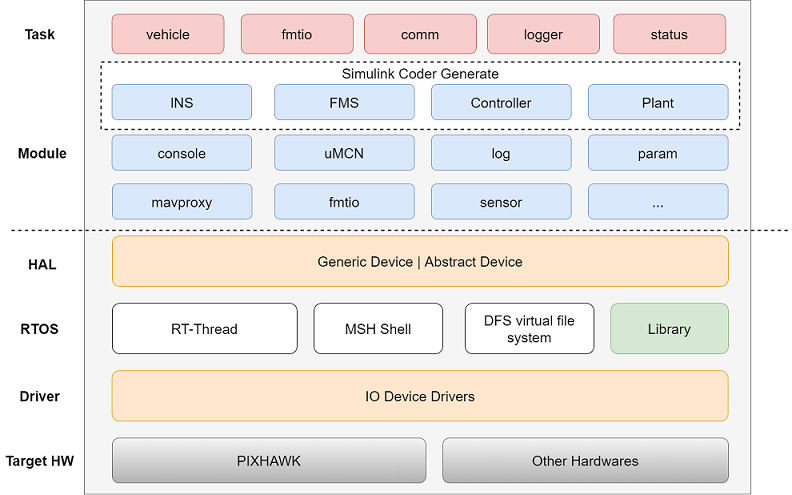

# FMT 固件
FMT Firmware 是用 C 语言编写的飞控嵌入式代码。是一款轻量级且更易于使用的嵌入式飞控系统。高度模块化的结构设计，使得可以被方便地移植到不同的硬件平台。

FMT Firmware 基于 Pixhawk 2.4.6/2.4.8 的硬件平台进行开发 (未来将支持到更多硬件平台上)，包括FMU (stm32F427) 和 IO (stm32F103) 两个部分的固件。支持Mavlink 1.0/2.0，所以可以支持主流的地面站，如QGC，Mission Planner 等。

## FMT Firmware架构
FMT Firmware 为飞控的嵌入式部分，采用**分层设计模式**，层与层，模块与模块之间松耦合，易于单独添加/删除模各个模块。 FMT Firmware 架构如下图所示。

它具体包括以下部分：

- 内核层 (RTOS): 内核层采用实时操作系统 RT-Thread,提供了例如多线程及其调度、信号量、邮箱、消息队列、内存管理、定时器等；DFS 是 RT-Thread 提供的虚拟文件系统组件，全称为 Device File System, 提供标准POSIX接口。MSH为RT-Thread提供的命令行系统组件，FMT基于MSH进一步封装，提供了丰富的指令。Library则包含一些三方库，如Mavlink, STIM32 Standard Library等。
- 驱动层 (Driver): 驱动层提供了Pixhawk板载和外扩的外设驱动支持，如IMU, GPS, 磁力计，气压计，SD卡，USB以及通信总线，如I2C，SPI，DMA等。
- 硬件抽象层 (HAL)： 在Driver层之上的HAL为上层提供统一的设备接口 (rt_read, rt_write, rt_control)，这样当替换不同的驱动设备或者移植到不同硬件上时，上层将不需要或者只需做很少的改动即可。一些与硬件无关的驱动逻辑也可以都放在HAL层中实现，这样就简化了驱动的开发难度。
- 模块层 (Module)：模块层提供FMT系统的基础功能模块，系统的大部分功能在这层实现，并提供给Task层进行组合，调用。比如跨进程通信模块uMCN提供基于发布/订阅模式的安全跨进程通信机制。log模块提供了二进制日志 (blog)和文字日志 (ulog)的功能。blog提供功能强大的数据记录功能，在不影响高优先级任务的前提下实时记录算法模块的输入/输入数据，供Simulink模型进行开环仿真。param参数模块提供方便的参数功能，支持命令行/地面站在线调参，并且参数将被记录到blog日志中，供仿真模块读取。算法模块INS, FMS, Controller为FMT Model生成的C/C++源文件，只要模块符合FMT Model Interface的标准，则可以直接嵌入到FMT飞控中，而无需做任何修改。Plant模块为无人机的物理模型 (也可以是其它对象模型)，同样为FMT Model生成。它主要是为了支持HIL Internal仿真模式，即无人机模型 (包括传感器模型)跑在飞控上而非外部的实时PC。
- 任务层 (Task)： 每个Task为一个单独的线程 (内部可以创建子线程) 实现独立的功能。比如最重要的`vehicle`任务，将选择适合被控对象的INS，FMS和Controller组件，负责周期性运行模型并采集和发布模型的输入/输出数据，因此vehicle任务具有最高优先级，以保证被控对象的稳定。fmtio任务负责跟IO协处理器进行通信，IO将提供RC和Motor等相关的功能。logger任务负责将采集blog和ulog的日志数据并存储到对应的存储设备，如SD卡。comm任务使用mavproxy模块的接口提供mavlink通信相关的功能。status任务的主要功能是显示当前系统的状态，可以通过LED，蜂鸣器和控制台等进行显示。
- 应用层 (App)  **(TODO)**: 应用层采用动态加载的模式，使用FMT提供的SDK实现一些复杂的任务功能，比如视觉避障，路径规划等。